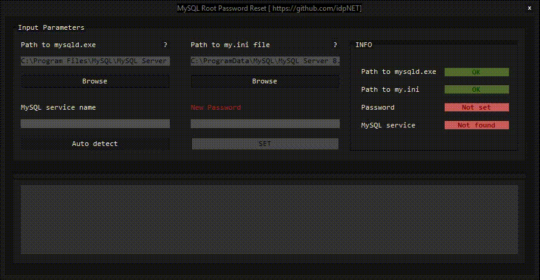

<br/>
<p align="center">
  <a href="https://github.com/idpNET/MySQL-Root-Password-Reset">
    
  </a>

  <h3 align="center">MySQL Root Password Reset</h3>

  <p align="center">
    An automated tool to change MySQL root password, in case, it is inaccessible or simply forgotten
    <br/>
    <a href="https://github.com/idpNET/MySQL-Root-Password-Reset"><strong>Explore the docs »</strong></a>
    <br/>
    <br/>
    <a href="https://github.com/idpNET/MySQL-Root-Password-Reset/Demo.gif">View Demo</a>
    .
    <a href="https://github.com/idpNET/MySQL-Root-Password-Reset/issues">Report Bug</a>
    .
    <a href="https://github.com/idpNET/MySQL-Root-Password-Reset/issues">Request Feature</a>
  </p>
</p>

## Table Of Contents

* [About the Project](#about-the-project)
* [Packages](#packages)
* [Installation](#installation)
* [Usage](#usage)
* [Roadmap](#roadmap)
* [Contributing](#contributing)
* [License](#license)
* [Authors](#authors)

## About The Project



In case you have forgotten your installed MySQL root user password, you can use this automated tool to change / set new password.
Providing the tool with MySQL mysqld.exe and my.ini files, along with a password, root user password can be  easily reset. There is also a service-name-auto-detection mechanism which helps you start and stop MySQL service without manually visiting local services of your machine.

Main Capabilities:

* Automated. NO need to manually run cmd commands / creating files.
* Having service-name-auto-detection mechanism.
* Password set capability
* Notifications to log runtime activities (comes in handy when debuging is needed) 

## packages

Microsoft System.ServiceProcess.ServiceController

* [System.ServiceProcess.ServiceController 7.0.1](https://www.nuget.org/packages/System.ServiceProcess.ServiceController/7.0.1)

## installation

1. Clone the repo in visual studio
```sh
https://github.com/idpNET/MySQL-Root-Password-Reset.git
```
2. Rebuild the project
3. Get started!

## Usage

You need to provide the tool with 4 input parameters :
1. Full path to mysqld.exe (By default, it should be <windows installation drive>\Program Files\MySQL\MySQL Server <Version>\mysql.exe)
2. Full path to my.ini (By default, it should be <windows installation drive>\ProgramData\MySQL\MySQL Server <Version>\my.ini)
3. MySQL service name (you can either use auto detection mechanism or manually enter the service name)
4. New password to be set

After setting the parameters above, you can click on "SET" button to start password set operation. In either cases of successful or unsuccessful operation, you can check out logs written in notifications panel.

P.S This project is well commented ! You can refer to the inline code comments for more information


## Roadmap

See the [open issues](https://github.com/idpNET/MySQL-Root-Password-Reset/issues) for a list of proposed features (and known issues).

## Contributing

Contributions are what make the open source community such an amazing place to be learn, inspire, and create. Any contributions you make are **greatly appreciated**.
* If you have suggestions for adding or removing projects, feel free to [open an issue](https://github.com/idpNET/MySQL-Root-Password-Reset/issues/new) to discuss it, or directly create a pull request after you edit the *README.md* file with necessary changes.
* Please make sure you check your spelling and grammar.
* Create individual PR for each suggestion.
* Please also read through the [Code Of Conduct](https://github.com/idpNET/MySQL-Root-Password-Reset/blob/main/CODE_OF_CONDUCT.md) before posting your first idea as well.

### Creating A Pull Request

1. Fork the Project
2. Create your Feature Branch (`git checkout -b feature/AmazingFeature`)
3. Commit your Changes (`git commit -m 'Add some AmazingFeature'`)
4. Push to the Branch (`git push origin feature/AmazingFeature`)
5. Open a Pull Request

## License

 licensed under the GNU General Public License v3.0

## Authors

* **Keyvan Hasani** - *Back-end developer and Ideapardaz.NET Administrator* - [Keyvan Hasani](https://github.com/idpNET) - *Developer*
